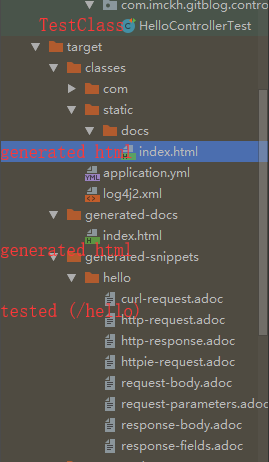
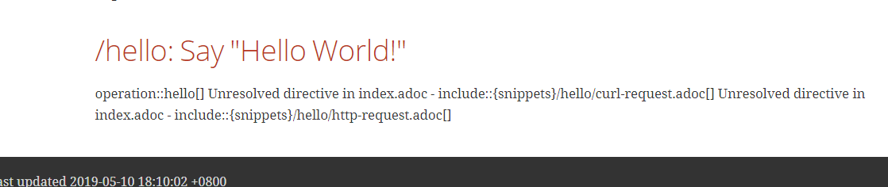

# snippets include error with spring-restdocs-asciidoctor

## summary

[git-blog-starter](git-blog-starter) runs springApplication, also includes config 
and [index.adoc](git-blog-starter/src/main/asciidoc/index.adoc)

[git-blog-api](git-blog-api) includes all controllers.

[HelloControllerTest](git-blog-starter/src/test/java/com/imckh/gitblog/controller/HelloControllerTest.java)
is test class(Log4j2)

## problem

use maven package and dont skip test, spring-restdocs generated below

but this is `index.html` content:

