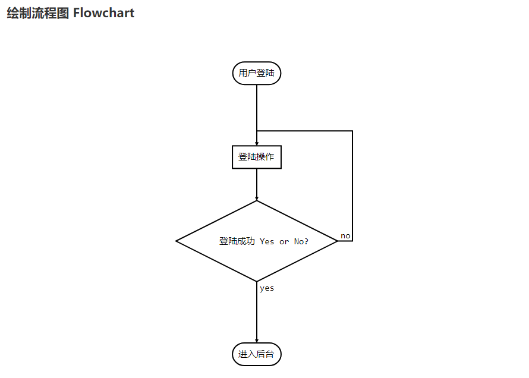

# git-blog 

 

Convert a github repository to a blog

## [前端仓库git-blog-front-end](https://github.com/imckh/git-blog-front-end)

## 已完成功能

### markdown解析

#### 目录生成

1. 链接形式的目录
    > 
2. 隐藏形目录
    > 

#### 科学公式
```
$$E=mc^2$$

行内的公式$$E=mc^2$$行内的公式，行内的$$E=mc^2$$公式。

$$x > y$$

$$\(\sqrt{3x-1}+(1+x)^2\)$$
                    
$$\sin(\alpha)^{\theta}=\sum_{i=0}^{n}(x^i + \cos(f))$$

多行公式：

```math
\displaystyle
\left( \sum\_{k=1}^n a\_k b\_k \right)^2
\leq
\left( \sum\_{k=1}^n a\_k^2 \right)
\left( \sum\_{k=1}^n b\_k^2 \right)
```(删掉这个括号内的)

```katex
\displaystyle 
    \frac{1}{
        \Bigl(\sqrt{\phi \sqrt{5}}-\phi\Bigr) e^{
        \frac25 \pi}} = 1+\frac{e^{-2\pi}} {1+\frac{e^{-4\pi}} {
        1+\frac{e^{-6\pi}}
        {1+\frac{e^{-8\pi}}
         {1+\cdots} }
        } 
    }
```(删掉这个括号内的)

```latex
f(x) = \int_{-\infty}^\infty
    \hat f(\xi)\,e^{2 \pi i \xi x}
    \,d\xi
```(删掉这个括号内的)
```


#### 序列图

```
```seq
Andrew->China: Says Hello 
Note right of China: China thinks\nabout it 
China-->Andrew: How are you? 
Andrew->>China: I am good thanks!
```(删掉这个括号内的)
```


#### 流程图

```
```flow
st=>start: 用户登陆
op=>operation: 登陆操作
cond=>condition: 登陆成功 Yes or No?
e=>end: 进入后台

st->op->cond
cond(yes)->e
cond(no)->op
```(删掉这个括号内的)
```



### 网页样式

#### 仓库目录


#### 滚动隐藏


#### 自适应


## 功能
- [ ] 基础功能
  - [ ] 注册
    - [ ] 生成一个用户的唯一网址
  - [ ] 登录
    - [ ] 只记录用户名/密码/仓库等信息, 并不保存markdown文章
    - [ ] 被查看次数
  - [ ] 登出
- [ ] 添加仓库
  - [ ] github 1.0 支持
  - [ ] 其他仓库以后支持
  - [ ] 自己搭建的仓库
  - [ ] Gitlab
  - [ ] BitBucket
  - [ ] 码云
- [x] ★遍历仓库(后端)
  - [x] 树形文件夹
  - [x] 文件夹下的markdown文件`.md;.markdown;.mdown`
- [ ] ★仓库(前端展示)
  - [ ] 树形文件夹
  - [ ] 文件夹下的markdown文件`.md;.markdown;.mdown`
- [ ] ★markdown文件转HTML
  - [ ] 基础格式
  - [ ] 带样式的网页
    - [ ] github
    - [ ] 代码: `IDEA`, `eclipse`等
- [ ] 社交, 以后或许会支持
  - [ ] 评论
    - [ ] 若加评论需要为文章保存唯一的ID, api.github.com中的sha不知道行不行
  - [ ] 点赞
    - [ ] 同评论
  - [ ] 一些关于社交的功能
    - [ ] 查看当前热门gitblog
    - [ ] 站内信息
    - [ ] 收藏
    - [ ] 点赞/评论历史记录


## 一些想法

1. 是不是可以把markdown转html的程序放在前台用js
   1. 可以减少服务端的压力
   2. 转化后的html样式多
   3. 后台只需递归repo的文件夹和树结构
2. ~~项目目录树状图~~
    1. ~~参考~~[~~ovity/octotree~~](https://github.com/ovity/octotree)
    2. [~~google chrome 插件~~](https://chrome.google.com/webstore/detail/octotree/bkhaagjahfmjljalopjnoealnfndnagc?hl=en-US)

