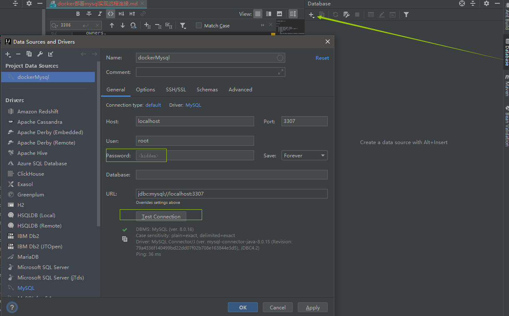

# docker部署mysql 实现远程连接

## 容器的操作

1. 创建
    1. `docker search mysql` 查看mysql版本
    2. `docker pull mysql`  要选择starts最高的那个name 进行下载
    3. `docker images`  查看下载好的镜像
    4. 启动mysql实例
        ```
        docker run --name dockermysql -p 3307:3306 -e MYSQL_ROOT_PASSWORD=root -d mysql
        
        --name 为mysql的实例设置别名。 
        -p 3307为对外暴露的端口, 3306是内部端口 
            -p 进行端口映射，格式为 主机(宿主)端口:容器端口
        -e MYSQL_ROOT_PASSWORD 设置mysql登录密码  
        -d 以守护进程运行(后台运行),并且返回容器的ID
        -i 以交互模式运行容器
        最后的mysql是镜像名称
        ```
    5. 运行4的时候报错
        ```
        C:\Program Files\Docker\Docker\Resources\bin\docker.exe: Error response from daemon: driver failed programming external connectivity on endpoint dockermysql (da2a710912ee3926864838f02d5994c25a236ef92776f2e04531a2275c676281):
         Error starting userland proxy: Bind for 0.0.0.0:3306: unexpected error Permission denied.
         
        cmd下运行 netstat -a -n 发现端口被占用, 主机端口更改即可
        ```
2. 查看
    - `docker ps`: 查看当前运行的容器
        ```
        PS C:\Users\ckh\Desktop> docker ps
        CONTAINER ID        IMAGE               COMMAND                  CREATED             STATUS              PORTS                               NAMES
        a87b15a7ea0c        mysql               "docker-entrypoint.s…"   12 seconds ago      Up 10 seconds       33060/tcp, 0.0.0.0:3307->3306/tcp   dockermysql
        ```
    - `docker ps -a`:查看所有容器，包括停止的。
3. 启动: 通过`docker start`来启动之前已经停止的docker_run镜像
4. 终止
    - `docker stop [NAME]/[CONTAINER ID]`:将容器退出。
    - `docker kill [NAME]/[CONTAINER ID]`:强制停止一个容器。
5. 删除: 容器终止后，在需要的时候可以重新启动，确定不需要了，可以进行删除操作。
    - `docker rm [NAME]/[CONTAINER ID]`:不能够删除一个正在运行的容器，会报错。需要先停止容器。
    - 一次性删除: `docker rm 'docker ps -a -q'`：-a标志列出所有容器，-q标志只列出容器的ID，然后传递给rm命令，依次删除容器

## 容器内部

1. `docker exec -it dockermysql bash`: 进入容器内部  dockermysql 是上边运行时为容器取的别名 也可以用id替代
2. `mysql -u root -p`: 然后直接输入密码即可 密码是在运行时设置的
    ```
    PS C:\Users\ckh\Desktop> docker exec -it dockermysql bash
    root@a87b15a7ea0c:/# root
    bash: root: command not found
    root@a87b15a7ea0c:/# mysql -u root -p
    Enter password:
    Welcome to the MySQL monitor.  Commands end with ; or \g.
    Your MySQL connection id is 8
    Server version: 8.0.16 MySQL Community Server - GPL
    
    Copyright (c) 2000, 2019, Oracle and/or its affiliates. All rights reserved.
    
    Oracle is a registered trademark of Oracle Corporation and/or its
    affiliates. Other names may be trademarks of their respective
    owners.
    
    Type 'help;' or '\h' for help. Type '\c' to clear the current input statement.
    # 查看用户信息
    mysql> select host,user,plugin,authentication_string from mysql.user;
    +-----------+------------------+-----------------------+------------------------------------------------------------------------+
    | host      | user             | plugin                | authentication_string                                                  |
    +-----------+------------------+-----------------------+------------------------------------------------------------------------+
    | %         | root             | caching_sha2_password | $A$005$f/,;;LD*uT-vx~T[IpV.PpPrUTDXYRprNzKuncqWZhoYMpwsNyKBGf7I9w1 |
    | localhost | mysql.infoschema | caching_sha2_password | $A$005$THISISACOMBINATIONOFINVALIDSALTANDPASSWORDTHATMUSTNEVERBRBEUSED |
    | localhost | mysql.session    | caching_sha2_password | $A$005$THISISACOMBINATIONOFINVALIDSALTANDPASSWORDTHATMUSTNEVERBRBEUSED |
    | localhost | mysql.sys        | caching_sha2_password | $A$005$THISISACOMBINATIONOFINVALIDSALTANDPASSWORDTHATMUSTNEVERBRBEUSED |
    | localhost | root             | caching_sha2_password | $A$005$a3
    (D!/syeD/p94Twz83JnLjtGvALMoGA/TyCyUimQG0Alc5m26 |
    +-----------+------------------+-----------------------+------------------------------------------------------------------------+
    5 rows in set (0.00 sec)
    
    # 修改root 可以通过任何客户端连接
    mysql> ALTER USER 'root'@'%' IDENTIFIED WITH mysql_native_password BY 'root';
    Query OK, 0 rows affected (0.10 sec)
    mysql> FLUSH PRIVILEGES; # 刷新一下
    Query OK, 0 rows affected (0.06 sec)
    ```

## 远程连接

1. 报错: mysql 8.0 默认使用 caching_sha2_password 身份验证机制 —— 从原来的 mysql_native_password 更改为 caching_sha2_password
    1. 修改用户的密码和加密方式
        ```sql
        ALTER USER 'root'@'%' IDENTIFIED WITH mysql_native_password BY '密码';
        ```
    2. 查看用户信息, 可以看到root变为了`mysql_native_password`
        ```
        mysql> select host,user,plugin,authentication_string from mysql.user;
        +-----------+------------------+-----------------------+------------------------------------------------------------------------+
        | host      | user             | plugin                | authentication_string                                                  |
        +-----------+------------------+-----------------------+------------------------------------------------------------------------+
        | %         | root             | mysql_native_password | *81F5E21E35407D884A6CD4A731AEBFB6AF209E1B                              |
        | localhost | mysql.infoschema | caching_sha2_password | $A$005$THISISACOMBINATIONOFINVALIDSALTANDPASSWORDTHATMUSTNEVERBRBEUSED |
        | localhost | mysql.session    | caching_sha2_password | $A$005$THISISACOMBINATIONOFINVALIDSALTANDPASSWORDTHATMUSTNEVERBRBEUSED |
        | localhost | mysql.sys        | caching_sha2_password | $A$005$THISISACOMBINATIONOFINVALIDSALTANDPASSWORDTHATMUSTNEVERBRBEUSED |
        | localhost | root             | caching_sha2_password | $A$005$a3
        (D!/syeD/p94Twz83JnLjtGvALMoGA/TyCyUimQG0Alc5m26 |
        +-----------+------------------+-----------------------+------------------------------------------------------------------------+
        5 rows in set (0.00 sec)
        ```
2. 使用IDEA自带的数据库工具连接
    